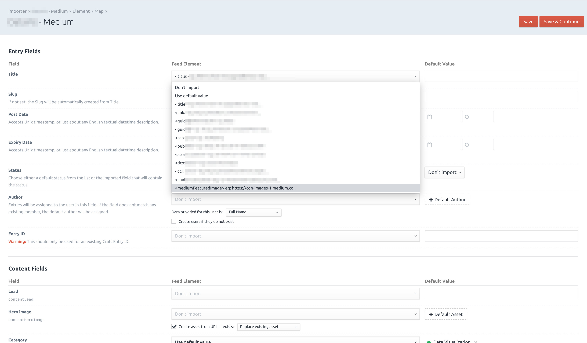

# Feed Me - Medium.com featured image plugin for Craft CMS 3.x

## Requirements

This plugin requires Craft CMS 3.0.0-RC1 and Feed Me 4.0.0 or later.

## Installation

To install the plugin, follow these instructions.

1. Open your terminal and go to your Craft project:

        cd /path/to/project

2. Then tell Composer to load the plugin:

        composer require webmenedzser/feed-me-medium-featured-image

3. In the Control Panel, go to Settings → Plugins and click the “Install” button for Feed Me - Medium.com featured image.

## Feed Me - Medium.com featured image Overview

Medium.com doesn't expose the featured or "sharing" image for articles in their RSS feed, so you couldn't import them into Craft. This plugin solves this issue: while fetching the feed from Medium.com, it scans the articles for their og:image tag and add them as an additional node on the feed, enhancing the feed provided by Medium.com.  

## Configuring Feed Me - Medium.com featured image

After installing the plugin just head over to Feed Me and edit your Feed's Field Mappings: if the feed is from medium.com, then the plugin will add an additional node to the feed provided by Medium: you can map that node to any field (Asset field included) from now. 

**Important note**: this plugin WILL slow down your site (specifically the parts where `EVENT_AFTER_FETCH_FEED` and `EVENT_AFTER_PARSE_FEED` events happen), as Craft has to fetch and parse all pages included in the feed from Medium.com. This takes time, which is usually around 5-10 seconds, depending on the size of your feed.

## Using Feed Me - Medium.com featured image

## Feed Me - Medium.com featured image Roadmap

Some things to do, and ideas for potential features:

* ~~Release it~~

Brought to you by [Ottó Radics](https://www.webmenedzser.hu)
